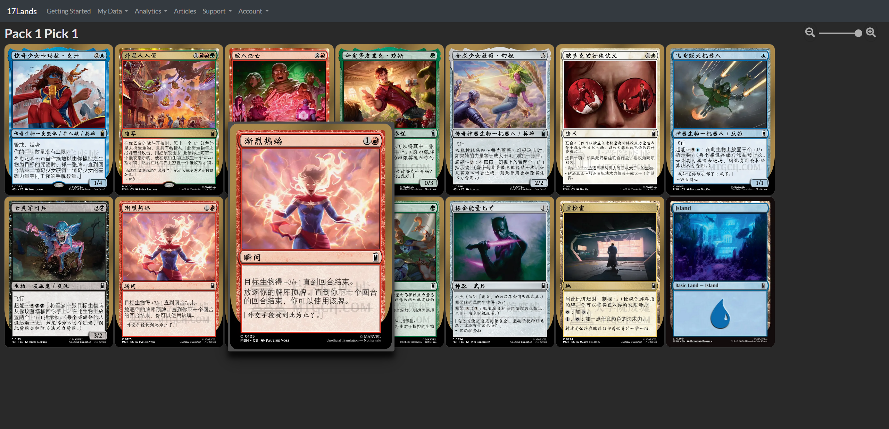
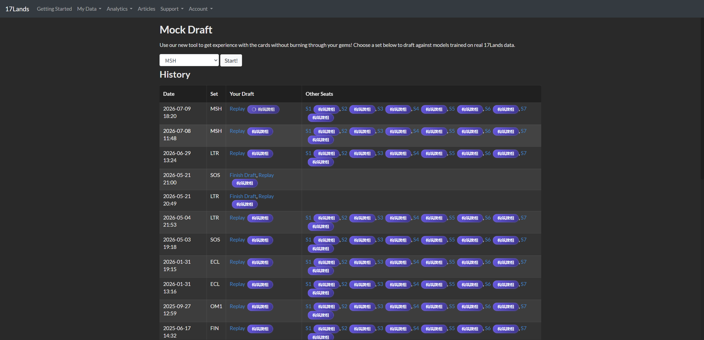
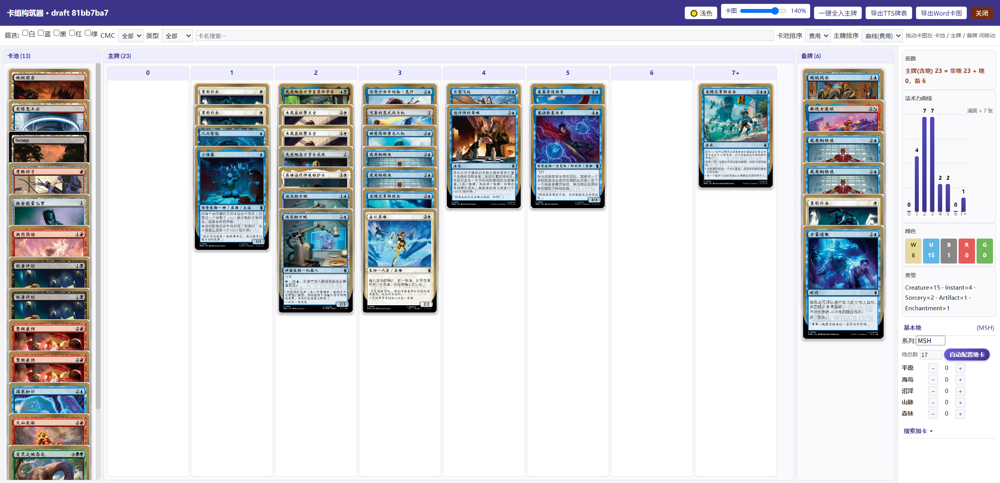
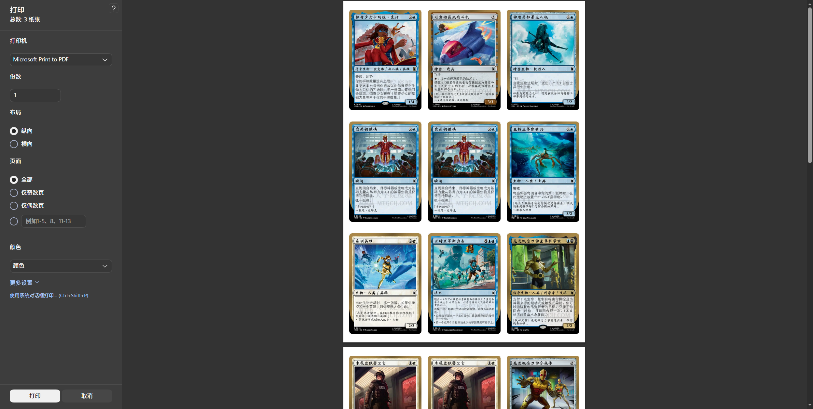
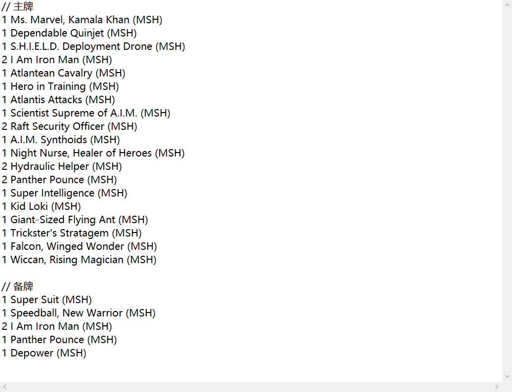

# 17Lands 中文卡图替换 + 卡组构筑器

在 [17Lands](https://www.17lands.com) 上自动把英文卡图替换为中文卡图，并提供拖拽式卡组构筑器，支持牌表导出、A4 卡图打印与基本地自动配置。

> 下方示例图像为功能示意，实际界面以浏览器内运行为准。

## 功能

### 中文卡图替换
将页面上的 Scryfall 英文卡图自动替换为 [大学院废墟](https://www.mtgch.com)（mtgch.com）的中文卡图，基本地回退原图避免空白。

### 读取轮抓记录构筑卡组
在轮抓完成之后可以在轮抓历史列表中点击构筑牌组按钮，等待加载，进入牌组构筑器

### 卡组构筑器
按法术力费用分列，每张卡为独立实例，可在 卡池 / 主牌 / 备牌 间自由拖拽、同列内重排，右侧实时显示张数、法术力曲线与颜色 / 类型统计。

### 打印与牌表导出
- **卡图打印导出**：A4 3×3 排列的打印级 HTML，无边距打印即可得到实体卡尺寸页面。
- **牌表导出**：生成「数量 卡名 (SET)」格式牌表，可直接用于 Tabletop Simulator中的万智牌mod。

### 其他
- **基本地管理**：加 / 减地、按主牌颜色比例自动配置地卡。
- **深浅主题切换** 与 **卡图缩放**。
- **搜索加卡**：通过 Scryfall 搜索补充卡牌到卡池。

## 使用
- 在历史轮抓链接后点击「构筑牌组」会自动拉取该轮抓卡池。
- 拖动卡图在 卡池 / 主牌 / 备牌 之间移动；主牌按费用分列，可跨列拖拽。
- 右侧面板查看张数、法术力曲线、颜色 / 类型统计，并管理基本地与导出。

## 致谢

本脚本的中文卡图来自 **[大学院废墟（万智牌中文网）](https://www.mtgch.com)**，卡图由 `images.mtgch.com` 提供。感谢该站长期整理与维护高质量的万智牌中文卡图资源，让中文玩家能更方便地阅读卡牌。

同时感谢：
- [17Lands](https://www.17lands.com) 提供轮抓数据平台。
- [Scryfall](https://scryfall.com) 提供卡牌数据与图片接口。

## 声明

- 本脚本为**免费、非商业**的个人爱好工具，仅在浏览器端按图片地址引用中文卡图，**不转存、不打包、不分发**任何卡图文件。
- 万智牌（Magic: The Gathering）及卡牌图像版权归 **Wizards of the Coast** 所有；中文卡图整理归大学院废墟所有。本项目与上述各方均无隶属或合作关系。
- 若图源站点不希望被本脚本调用，请联系作者，将第一时间配合调整或移除。

## 项目地址
https://github.com/tttyz9/17lands-cn-userscript